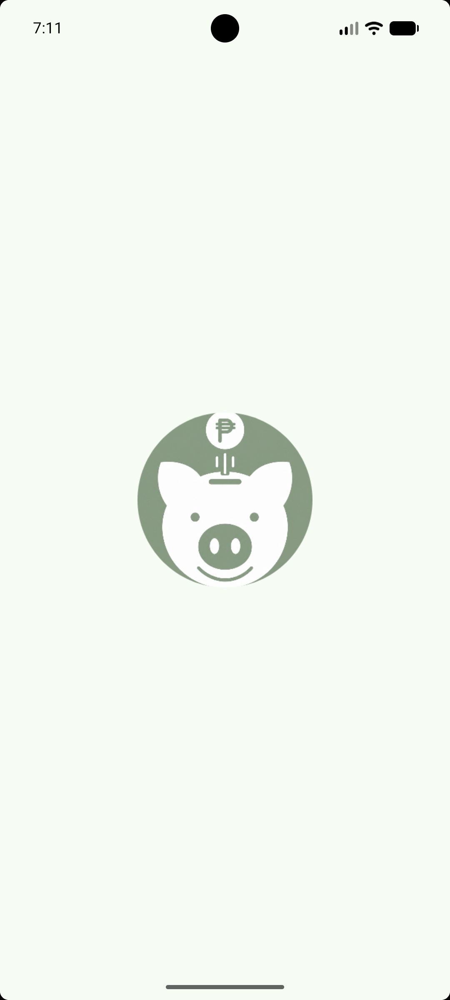
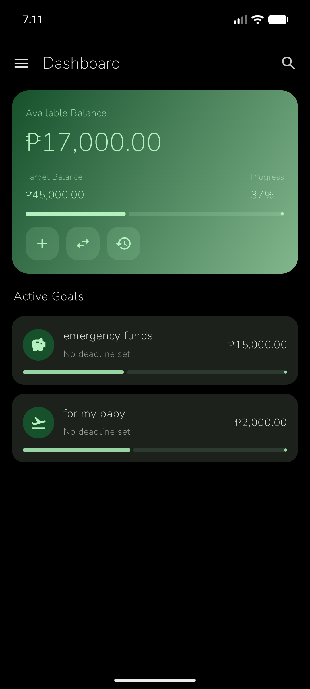
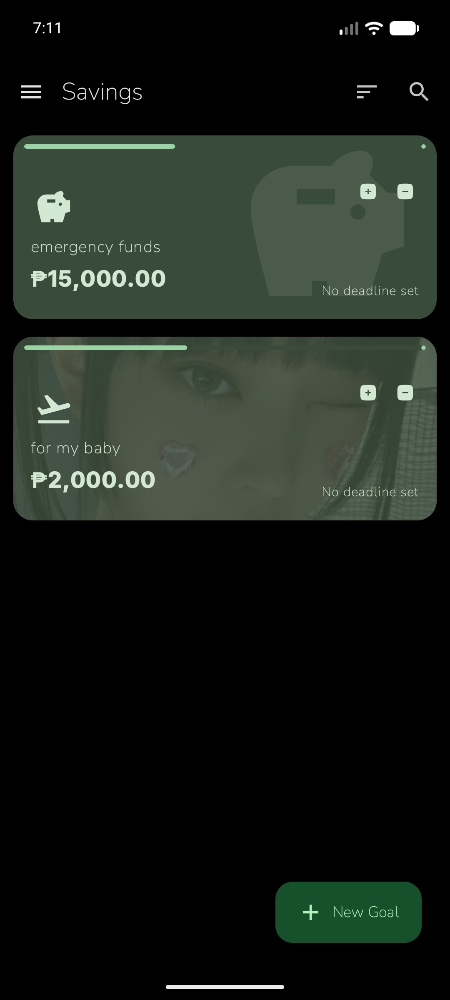

# Piggo

Piggo is a simple Android savings tracker for creating money goals, tracking deposits, reviewing progress, and moving funds between stashes.

<p align="center">
  
  
  
</p>

## Features

- Create and manage savings goals.
- Track available balance, target balance, and goal progress.
- Add deposits and review transaction history.
- Transfer money between stashes.
- Set reminders and backup savings data.
- Use a clean Jetpack Compose interface with dark mode styling.
- Read the privacy policy directly inside the app.

## Tech Stack

- Kotlin
- Android Jetpack Compose
- Room
- Hilt
- DataStore Preferences
- WorkManager
- Coil
- Kotlin Serialization

## Build

1. Clone the repository.

   ```bash
   git clone https://github.com/guel678/Piggo.git
   cd Piggo
   ```

2. Open the project in Android Studio.

3. Sync Gradle and run the `app` configuration, or build from the terminal.

   ```bash
   ./gradlew assembleDebug
   ```

## Project Info

- Package: `piggo.saving.ph`
- Min SDK: 24
- Target SDK: 36
- Version: `1.0.0`

## License

This project is licensed under the terms in [LICENSE](LICENSE).
